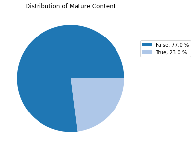
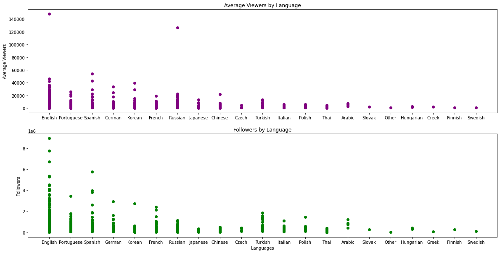
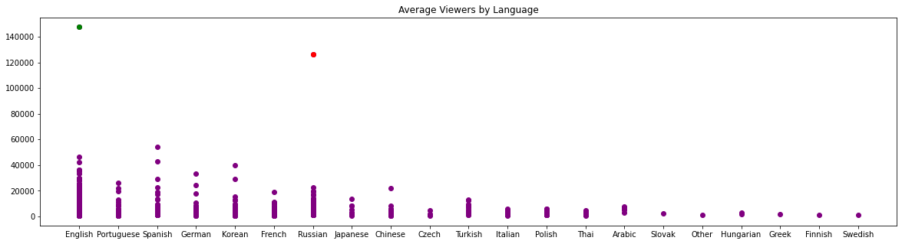

# An Analysis of The Pre-COVID Twitch Era

#### Carmie Hsiao, Tyler Young

## Introduction


### About the Dataset

A dataset was compiled by Aayush Mishra that focused on the top 1000 Twitch streamers based on watch time. There are quite a few things that can be inferred from this data which we wanted to explore. We want to examine what would make channels outliers in each of the different categories of data, determine what makes channels so popular, and see what sort of trends come out of the outlying channels.

One very important thing to understand about this dataset is that this data was collected **before** the COVID-19 pandemic. According to [this website](https://twitchtracker.com/statistics/watch-time) tracking Twitch's overall watch time, the pandemic nearly *doubled* the amount of watch time Twitch was receiving, and that trend continued well into 2021.


### Motivations

We chose this dataset because Twitch has been on its uprise for the better part of the past few years, and it would provide valuable information on what exactly makes any given stream go viral, as well as stay relevant beyond that. Twitch is a platform filled with outliers, but examining them can give a ton of insight on the matter.


### Expectations

Using scatterplots and boxplots, we plan to find outliers and examine them more closely. There are several things that we can draw from them, and our general hypothesis we hope to test here is that **being an outlier is predictive of something unique about a given stream channel**. There are a variety of reasons that a channel could be unique, which we will discuss in more detail later, but in short, the aspects include big event streams, eSports organizations, tournament hosts, and channels that stream either a lot more than average or way below average.

## Part I: Data collection/wrangling


### Tools
First, we imported the necessary libraries for this project, -


```python
# Libraries for data wrangling and transformation
import pandas as pd
import numpy as np

# Libraries for data analysis
import matplotlib.pyplot as plt
from scipy.optimize import curve_fit

# Miscellaneous
from datetime import datetime
from matplotlib import cm
import matplotlib.colors as mcolors
```

### Data Collection
This dataset is already pretty useful on its own, as it's exactly 1000 data points with nothing missing. So we're simply going to use pandas to read the CSV file and then do some quick scatterplots to just do some preliminary comparisons.


```python
data = pd.read_csv("twitchdata-update.csv")

# Modifying data with extra rows for analysis/cleaning
def convertwt(row):
    n = float(row["Watch time(Minutes)"])/60/60
    return n
def convertst(row):
    n = float(row["Stream time(minutes)"])/60/60
    return n

data["Watch time(days)"] = data.apply(lambda row: 
                                      convertwt(row),
                                      axis = 1)
data["Stream time(days)"] = data.apply(lambda row: 
                                       convertst(row),
                                       axis = 1)
# Dropping attributes unused in our analysis
data = data.drop(['Partnered', 
                  'Watch time(Minutes)',
                  'Stream time(minutes)'],
                 axis = 1)


data.head()
```


<div>
<style scoped>
    .dataframe tbody tr th:only-of-type {
        vertical-align: middle;
    }

    .dataframe tbody tr th {
        vertical-align: top;
    }

    .dataframe thead th {
        text-align: right;
    }
</style>
<table border="1" class="dataframe">
  <thead>
    <tr style="text-align: right;">
      <th></th>
      <th>Channel</th>
      <th>Peak viewers</th>
      <th>Average viewers</th>
      <th>Followers</th>
      <th>Followers gained</th>
      <th>Views gained</th>
      <th>Mature</th>
      <th>Language</th>
      <th>Watch time(days)</th>
      <th>Stream time(days)</th>
    </tr>
  </thead>
  <tbody>
    <tr>
      <th>0</th>
      <td>xQcOW</td>
      <td>222720</td>
      <td>27716</td>
      <td>3246298</td>
      <td>1734810</td>
      <td>93036735</td>
      <td>False</td>
      <td>English</td>
      <td>1.721156e+06</td>
      <td>59.791667</td>
    </tr>
    <tr>
      <th>1</th>
      <td>summit1g</td>
      <td>310998</td>
      <td>25610</td>
      <td>5310163</td>
      <td>1370184</td>
      <td>89705964</td>
      <td>False</td>
      <td>English</td>
      <td>1.692133e+06</td>
      <td>58.845833</td>
    </tr>
    <tr>
      <th>2</th>
      <td>Gaules</td>
      <td>387315</td>
      <td>10976</td>
      <td>1767635</td>
      <td>1023779</td>
      <td>102611607</td>
      <td>True</td>
      <td>Portuguese</td>
      <td>1.567942e+06</td>
      <td>143.133333</td>
    </tr>
    <tr>
      <th>3</th>
      <td>ESL_CSGO</td>
      <td>300575</td>
      <td>7714</td>
      <td>3944850</td>
      <td>703986</td>
      <td>106546942</td>
      <td>False</td>
      <td>English</td>
      <td>1.102866e+06</td>
      <td>143.816667</td>
    </tr>
    <tr>
      <th>4</th>
      <td>Tfue</td>
      <td>285644</td>
      <td>29602</td>
      <td>8938903</td>
      <td>2068424</td>
      <td>78998587</td>
      <td>False</td>
      <td>English</td>
      <td>1.019722e+06</td>
      <td>34.350000</td>
    </tr>
  </tbody>
</table>
</div>


## Part II: Data Exploration

### Observing patterns
We started our analysis through the comparison of different independent variables to determine what relationships, commonalities, or differences were present in the data. To do this, we explored different comparisons between the channels.


```python
# Plot 1
plt.figure(figsize=(20,5))
plt.subplot(1,3,1)
plt.scatter(data["Views gained"], data["Followers gained"])
plt.title("Views gained vs Followers gained")
plt.xlabel("Views")
plt.ylabel("Followers gained")
# Plot 2
plt.subplot(1,3,2)
plt.scatter(data["Average viewers"], data["Peak viewers"], 
            color = "purple")
plt.title("Average Viewers vs Peak viewers")
plt.xlabel("Average Viewers")
plt.ylabel("Peak Viewers")
# Plot 3
plt.subplot(1,3,3)
plt.scatter(data["Followers gained"], data["Followers"], 
            color = "tab:red")
plt.title("Followers gained vs Followers (current)")
plt.xlabel("Followers gained")
plt.ylabel("Current Followers")
plt.show()
```


    

    


In the graphs above, the overall shapes seemed generally consistent, with the exception of the distribution of outliers. What the 2nd graph here shows are channels that are essentially "one tricks"-- those which have high peaks but not much else to show. The 3rd graph shows which channels had many followers previously, and which ones gained a lot more in the year of data collected.

In the following comparisons that include watch time and stream time, we added an exponential fit function to help distinguish the different trends.


```python
# Customized fit function
def objective(x, a, b, c):
    return a * x + b * x**2 + c

plt.figure(figsize=(10,10))

# Subplot 1
c1 = plt.subplot(2,2,1)
c1 = plt.scatter(data["Stream time(days)"], data["Peak viewers"], 
                 color = "orange")
plt.title("Stream time vs. Peak Viewers")
plt.ylabel("Peak Viewers")
plt.xlabel("Stream time")
## Fitting the data
popt, _ = curve_fit(objective, data["Stream time(days)"],  
                    data["Peak viewers"])
a, b, c = popt
x_line = np.arange(min(data["Stream time(days)"]), 
                   max(data["Stream time(days)"]), 0.8)
y_line = objective(x_line, a, b, c)

plt.plot(x_line, y_line, '--', color='blue')

# Subplot 2
c2 = plt.subplot(2,2,2)
c2 = plt.scatter(data["Watch time(days)"], data["Peak viewers"])
plt.title("Watch time vs. Peak Viewers")
plt.xlabel("Watch Time")
## Fitting the data
popt, _ = curve_fit(objective, data["Watch time(days)"],  
                    data["Peak viewers"])
a, b, c = popt
x_line = np.arange(min(data["Watch time(days)"]), 
                   max(data["Watch time(days)"]), 0.8)
y_line = objective(x_line, a, b, c)

plt.plot(x_line, y_line, '--', color='red')


# Subplot 3
c1 = plt.subplot(2,2,3)
c1 = plt.scatter(data["Stream time(days)"], data["Average viewers"], 
                 color = "orange")
plt.title("Stream time vs. Average Viewers")
plt.xlabel("Stream time")
plt.ylabel("Average Viewers")
## Fitting the data
popt, _ = curve_fit(objective, data["Stream time(days)"],  
                    data["Average viewers"])
a, b, c = popt
x_line = np.arange(min(data["Stream time(days)"]),
                   max(data["Stream time(days)"]), 0.8)
y_line = objective(x_line, a, b, c)

plt.plot(x_line, y_line, '--', color='blue')

# Subplot 4
c2 = plt.subplot(2,2,4)
c2 = plt.scatter(data["Watch time(days)"], data["Average viewers"])
plt.title("Watch time vs. Average Viewers")
plt.xlabel("Watch Time")
## Fitting the data
popt, _ = curve_fit(objective, data["Watch time(days)"], 
                    data["Average viewers"])
a, b, c = popt
x_line = np.arange(min(data["Watch time(days)"]), 
                   max(data["Watch time(days)"]), 0.8)
y_line = objective(x_line, a, b, c)

plt.plot(x_line, y_line, '--', color='red')

plt.show()
```


    

    


In the resulting patterns observed, most of the channels follow their respective curves except for the outliers. We will return to those edge cases in a bit.

The main reason we examined average viewers as well as peak viewers is the type of channels that each one would favor. Our assumption is as follows: average viewers generally represent a much more stable viewership, even if overall, the numbers are a bit lower. Using peak viewers causes channels that host large events, but otherwise don't stream much else, to show much larger numbers. This is similar to the peak vs. average viewers and followers vs. followers gained graphs, but these follow a different trend.

### Partitioning the Data

Next, though we had outliers in the overall streamer population, we also have to consider channels that are outliers within certain groups of channels. So we decided to partition the data into sections to analyze them in categories, to see what sorts of outliers appear within them. 


```python
# Grouping data into "Mature Content" and "No Mature Content"
mat = data["Mature"].unique()
mats = data.groupby(["Mature"])["Channel"].count()
mats = mats.sort_values(axis=0, ascending=False)

fig1, ax1 = plt.subplots(figsize=(5,5))
pichart = ax1.pie(mats,colors=cmap)
percents = mats.values * 100 / mats.values.sum()
legend = ['%s, %1.1f %%' % (l, s) 
          for l, s in zip(mats.index,percents)]
plt.legend(labels = legend
           ,bbox_to_anchor=(1,0.8))
plt.title("Distribution of Mature Content")
plt.show()
```


    

    


The distribution of mature and non-mature content is interesting, but there's not really much to take away, so we'll move onto language instead.


```python
# Creating a new dataframe
lang = data["Language"].unique()
langs = data.groupby(["Language"])["Channel"].count().sort_values(
    axis=0,
    ascending=False)
langs
```


    Language
    English       485
    Korean         77
    Russian        74
    Spanish        68
    French         66
    Portuguese     61
    German         49
    Chinese        30
    Turkish        22
    Italian        17
    Polish         12
    Thai           11
    Japanese       10
    Czech           6
    Arabic          5
    Hungarian       2
    Other           1
    Greek           1
    Slovak          1
    Finnish         1
    Swedish         1
    Name: Channel, dtype: int64


```python
# Colors
cmap = cm.tab20(np.arange(lang.size))

# Pie Chart Creation
fig1, ax1 = plt.subplots(figsize=(10,10))
pichart = ax1.pie(langs,colors=cmap)
percents = langs.values * 100 / langs.values.sum()
legend = ['%s, %1.1f %%' % (l, s) 
          for l, s in zip(langs.index,percents)]
plt.legend(labels = legend
           ,bbox_to_anchor=(1,0.8))
plt.title("Distribution of Stream Languages")
plt.show()
```


    

    


As can be seen here, english is the majority, so it is important to partition the data by language so that region-specific outliers wouldn't be hidden by the sheer amount of English-language streams.


In order to remove languages as a potential bias, we decided to group the data by language and examine each of them separately. We will examine average viewers, followers, viewers gained, and followers gained. It's useful to compare all 4 of these, because the "gained" followers and viewers represent growth in the year this data was collected, so it levels the playing field for newer channels a bit.


```python
plt.figure(figsize=(20,10))   

# Subplot 1
l1 = plt.subplot(2,1,1)
l1 = plt.scatter(data["Language"], data["Average viewers"], 
                 color = "purple")
plt.title("Average Viewers by Language")
plt.ylabel("Average Viewers")

# Subplot 2
l2 = plt.subplot(2,1,2)
l2 = plt.scatter(data["Language"],data["Followers"],  
                 color = "green")
plt.title("Followers by Language")
plt.ylabel("Followers")
plt.xlabel("Languages")
plt.show()
```


    

    


```python
plt.figure(figsize=(20,10))   

# Subplot 1
l1 = plt.subplot(2,1,1)
l1 = plt.scatter(data["Language"], data["Views gained"], 
                 color = "purple")
plt.title("Views gained by Language")
plt.ylabel("Views gained")

# Subplot 2
l2 = plt.subplot(2,1,2)
l2 = plt.scatter(data["Language"],data["Followers gained"],  
                 color = "green")
plt.title("Followers gained by Language")
plt.xlabel("Languages")
plt.ylabel("Followers gained")
plt.show()
```


    

    


It's fairly clear that viewers and followers gained are closely correlated, but there are a few outliers, which we will examine after partitioning the data by language.

Next, we will create boxplots for each language's data.


```python

#Creating stream time arrays for each language
st = []
for l in lang:
    ar = []
    ct = data[data["Language"] == l]
    for le in ct["Stream time(days)"]:
        ar.append(le)
    st.append(ar)

plt.figure(figsize=(20,10))
box = plt.boxplot(st,labels=lang)
plt.title("Stream time by Language (days)")
plt.xlabel("Language")
plt.ylabel("Stream Time")
plt.show()
```


    

    


Even within the distibutions shown as such, there's still a general trend in terms of stream time. With more channels, of course, there's more variation.

Important to understand is that some channels have multiple viewer counts that are split between different sources. Looking at the data, there are a few channels all under the same name-- take, for example, Riot Games. Out of the 1000 top channels in the dataset, 6 of them are all under Riot Games, each with their own region. Thus, one way we will be analyzing the data is by separating the channels by language to do further analysis. Then, it will be useful to analyze the channels after removing the big gaming channels to see what sort of outliers still remain.

### Investigating outliers in the exploratory data

Now that we have several plots, we look at the data to examine what outliers there are. Because this data set is fairly small, it was pretty easy to determine which points were outliers and start noticing patterns. In particular, one thing we noticed across all the outliers was larger companies and eSports, such as Riot Games, Valve, DOTA 2, Overwatch League, Rainbow 6 Siege, etc.

#### Case I: Followers gained vs Views gained Ratio


```python
data.sort_values(axis=0,by='Followers gained',
                 ascending=False).head(6)
```


<div>
<style scoped>
    .dataframe tbody tr th:only-of-type {
        vertical-align: middle;
    }

    .dataframe tbody tr th {
        vertical-align: top;
    }

    .dataframe thead th {
        text-align: right;
    }
</style>
<table border="1" class="dataframe">
  <thead>
    <tr style="text-align: right;">
      <th></th>
      <th>Channel</th>
      <th>Peak viewers</th>
      <th>Average viewers</th>
      <th>Followers</th>
      <th>Followers gained</th>
      <th>Views gained</th>
      <th>Mature</th>
      <th>Language</th>
      <th>Watch time(days)</th>
      <th>Stream time(days)</th>
    </tr>
  </thead>
  <tbody>
    <tr>
      <th>14</th>
      <td>auronplay</td>
      <td>170115</td>
      <td>53986</td>
      <td>3983847</td>
      <td>3966525</td>
      <td>41514854</td>
      <td>False</td>
      <td>Spanish</td>
      <td>6.694507e+05</td>
      <td>11.270833</td>
    </tr>
    <tr>
      <th>13</th>
      <td>Rubius</td>
      <td>240096</td>
      <td>42948</td>
      <td>5751354</td>
      <td>3820532</td>
      <td>58599449</td>
      <td>False</td>
      <td>Spanish</td>
      <td>7.190646e+05</td>
      <td>16.187500</td>
    </tr>
    <tr>
      <th>25</th>
      <td>TheGrefg</td>
      <td>538444</td>
      <td>28887</td>
      <td>3795667</td>
      <td>3593081</td>
      <td>47094362</td>
      <td>False</td>
      <td>Spanish</td>
      <td>4.881685e+05</td>
      <td>15.237500</td>
    </tr>
    <tr>
      <th>51</th>
      <td>Bugha</td>
      <td>66311</td>
      <td>12982</td>
      <td>2942212</td>
      <td>2220765</td>
      <td>49441744</td>
      <td>False</td>
      <td>English</td>
      <td>3.679220e+05</td>
      <td>27.908333</td>
    </tr>
    <tr>
      <th>90</th>
      <td>pokimane</td>
      <td>112160</td>
      <td>16026</td>
      <td>5367605</td>
      <td>2085831</td>
      <td>45579002</td>
      <td>False</td>
      <td>English</td>
      <td>2.678706e+05</td>
      <td>15.695833</td>
    </tr>
    <tr>
      <th>4</th>
      <td>Tfue</td>
      <td>285644</td>
      <td>29602</td>
      <td>8938903</td>
      <td>2068424</td>
      <td>78998587</td>
      <td>False</td>
      <td>English</td>
      <td>1.019722e+06</td>
      <td>34.350000</td>
    </tr>
  </tbody>
</table>
</div>


```python
data.sort_values(axis=0,by='Views gained',
                 ascending=False).head(3)
```


<div>
<style scoped>
    .dataframe tbody tr th:only-of-type {
        vertical-align: middle;
    }

    .dataframe tbody tr th {
        vertical-align: top;
    }

    .dataframe thead th {
        text-align: right;
    }
</style>
<table border="1" class="dataframe">
  <thead>
    <tr style="text-align: right;">
      <th></th>
      <th>Channel</th>
      <th>Peak viewers</th>
      <th>Average viewers</th>
      <th>Followers</th>
      <th>Followers gained</th>
      <th>Views gained</th>
      <th>Mature</th>
      <th>Language</th>
      <th>Watch time(days)</th>
      <th>Stream time(days)</th>
    </tr>
  </thead>
  <tbody>
    <tr>
      <th>7</th>
      <td>Fextralife</td>
      <td>68795</td>
      <td>18985</td>
      <td>508816</td>
      <td>425468</td>
      <td>670137548</td>
      <td>False</td>
      <td>English</td>
      <td>9.171854e+05</td>
      <td>41.079167</td>
    </tr>
    <tr>
      <th>703</th>
      <td>Igromania</td>
      <td>6159</td>
      <td>939</td>
      <td>184078</td>
      <td>13710</td>
      <td>115312954</td>
      <td>False</td>
      <td>Russian</td>
      <td>4.780178e+04</td>
      <td>51.933333</td>
    </tr>
    <tr>
      <th>3</th>
      <td>ESL_CSGO</td>
      <td>300575</td>
      <td>7714</td>
      <td>3944850</td>
      <td>703986</td>
      <td>106546942</td>
      <td>False</td>
      <td>English</td>
      <td>1.102866e+06</td>
      <td>143.816667</td>
    </tr>
  </tbody>
</table>
</div>


```python
# Extracting outlier data
ext = data.sort_values(axis=0,by='Followers gained',
                       ascending=False).head(3)
ext2 = data.sort_values(axis=0,by='Views gained',
                        ascending=False).head(1)

plt.figure(figsize=(5,5))
plt.scatter(data["Views gained"], data["Followers gained"])
plt.scatter(ext["Views gained"], ext["Followers gained"])
plt.scatter(ext2["Views gained"], ext2["Followers gained"], 
            color = "magenta")

plt.title("Views gained vs Followers gained")
plt.xlabel("Views")
plt.ylabel("Followers gained")
plt.show()
```


    

    


Upon closer examination, each of the orange-highlighted outliers are Spanish-language streamers-- each of which got a lot more followers than they did views. The other outlier is Fextralife, a gaming channel which got a ton more views but not as many followers as a result. Fextralife is actually an organization that does gaming reviews and guides, so it makes sense that it would show up as such.

#### Case II: Average Viewers by Language


```python
# Retrieving outlier data
eng = data[data["Language"] == "English"].sort_values(
    axis=0,
    by='Average viewers',
    ascending=False).head(1)
rus = data[data["Language"] == "Russian"].sort_values(
    axis=0,
    by='Average viewers',
    ascending=False).head(1)

plt.figure(figsize=(20,5))
plt.scatter(data["Language"], data["Average viewers"], 
            color = "purple")
plt.scatter(rus["Language"], rus["Average viewers"], 
            color = "red")
plt.scatter(eng["Language"], eng["Average viewers"], 
            color = "green")
plt.title("Average Viewers by Language")
plt.show()
```


    

    


```python
data[data["Language"] == "English"].sort_values(
    axis=0, by='Average viewers',
    ascending=False).head(3)
```


<div>
<style scoped>
    .dataframe tbody tr th:only-of-type {
        vertical-align: middle;
    }

    .dataframe tbody tr th {
        vertical-align: top;
    }

    .dataframe thead th {
        text-align: right;
    }
</style>
<table border="1" class="dataframe">
  <thead>
    <tr style="text-align: right;">
      <th></th>
      <th>Channel</th>
      <th>Peak viewers</th>
      <th>Average viewers</th>
      <th>Followers</th>
      <th>Followers gained</th>
      <th>Views gained</th>
      <th>Mature</th>
      <th>Language</th>
      <th>Watch time(days)</th>
      <th>Stream time(days)</th>
    </tr>
  </thead>
  <tbody>
    <tr>
      <th>81</th>
      <td>dota2ti</td>
      <td>483530</td>
      <td>147643</td>
      <td>663297</td>
      <td>121422</td>
      <td>16228039</td>
      <td>False</td>
      <td>English</td>
      <td>2.826604e+05</td>
      <td>1.754167</td>
    </tr>
    <tr>
      <th>41</th>
      <td>LCS</td>
      <td>214124</td>
      <td>46459</td>
      <td>1162746</td>
      <td>526244</td>
      <td>28313058</td>
      <td>False</td>
      <td>English</td>
      <td>4.059195e+05</td>
      <td>8.645833</td>
    </tr>
    <tr>
      <th>5</th>
      <td>Asmongold</td>
      <td>263720</td>
      <td>42414</td>
      <td>1563438</td>
      <td>554201</td>
      <td>61715781</td>
      <td>False</td>
      <td>English</td>
      <td>1.019111e+06</td>
      <td>22.850000</td>
    </tr>
  </tbody>
</table>
</div>


Stream time for DOTA 2 is significantly low compared to the other members of the group. That said, among the English streams, despite only streaming for 1.75 days, they received by far the highest viewer counts. Upon researching, this channel and its Russian counterpart are for The International (TI), a very large DOTA 2 event that took place in Shanghai in 2019. This would explain the extremely high average viewers, as the event was barely 2 days long, and it has nothing else in the year to drag the average down. So in conclusion, the reason these channels are outliers are specifically because they are **only** used for this event each year. Comparing this to LCS (League of Legends Championship Series), which totaled 8.6 days of stream time, but only averaged about 1/3 of what TI did. *Note that DOTA 2 is the same outlier as seen in some of the above plots.*

Next, we will look at the Russian stream data.


```python
data[data["Language"] == "Russian"].sort_values(
    axis=0,
    by='Average viewers',
    ascending=False).head(3)
```


<div>
<style scoped>
    .dataframe tbody tr th:only-of-type {
        vertical-align: middle;
    }

    .dataframe tbody tr th {
        vertical-align: top;
    }

    .dataframe thead th {
        text-align: right;
    }
</style>
<table border="1" class="dataframe">
  <thead>
    <tr style="text-align: right;">
      <th></th>
      <th>Channel</th>
      <th>Peak viewers</th>
      <th>Average viewers</th>
      <th>Followers</th>
      <th>Followers gained</th>
      <th>Views gained</th>
      <th>Mature</th>
      <th>Language</th>
      <th>Watch time(days)</th>
      <th>Stream time(days)</th>
    </tr>
  </thead>
  <tbody>
    <tr>
      <th>109</th>
      <td>dota2ti_ru</td>
      <td>457060</td>
      <td>126232</td>
      <td>541644</td>
      <td>108438</td>
      <td>12068376</td>
      <td>False</td>
      <td>Russian</td>
      <td>225705.025000</td>
      <td>1.720833</td>
    </tr>
    <tr>
      <th>811</th>
      <td>DreamHackDota2_RU</td>
      <td>98717</td>
      <td>22356</td>
      <td>203419</td>
      <td>30231</td>
      <td>3637232</td>
      <td>False</td>
      <td>Russian</td>
      <td>42350.320833</td>
      <td>1.704167</td>
    </tr>
    <tr>
      <th>319</th>
      <td>RiotGamesRU</td>
      <td>73049</td>
      <td>19753</td>
      <td>173861</td>
      <td>75538</td>
      <td>6832561</td>
      <td>False</td>
      <td>Russian</td>
      <td>97972.429167</td>
      <td>4.966667</td>
    </tr>
  </tbody>
</table>
</div>


Once again, we can see DOTA 2's TI at the top of this list. Interestingly, the top Russian-language streams all happen to be eSports and events.

Next, we examine the top follower counts of the dataset.

#### Case III: Followers By Language


```python
# Isolating Rubius' data
rubi = data[data["Language"] == "Spanish"].sort_values(
    axis=0,by='Followers',
    ascending=False).head(1)

plt.figure(figsize=(20,5))
plt.scatter(data["Language"], data["Followers"], 
            color = "green")
plt.scatter(rubi["Language"], rubi["Followers"], 
            color = "red")
plt.title("Followers by Language")
plt.show()
```


    

    


```python
# The top 5 follower counts (including Rubius)
data.sort_values(axis=0,by='Followers',
                 ascending=False).head(5)
```


<div>
<style scoped>
    .dataframe tbody tr th:only-of-type {
        vertical-align: middle;
    }

    .dataframe tbody tr th {
        vertical-align: top;
    }

    .dataframe thead th {
        text-align: right;
    }
</style>
<table border="1" class="dataframe">
  <thead>
    <tr style="text-align: right;">
      <th></th>
      <th>Channel</th>
      <th>Peak viewers</th>
      <th>Average viewers</th>
      <th>Followers</th>
      <th>Followers gained</th>
      <th>Views gained</th>
      <th>Mature</th>
      <th>Language</th>
      <th>Watch time(days)</th>
      <th>Stream time(days)</th>
    </tr>
  </thead>
  <tbody>
    <tr>
      <th>4</th>
      <td>Tfue</td>
      <td>285644</td>
      <td>29602</td>
      <td>8938903</td>
      <td>2068424</td>
      <td>78998587</td>
      <td>False</td>
      <td>English</td>
      <td>1.019722e+06</td>
      <td>34.350000</td>
    </tr>
    <tr>
      <th>96</th>
      <td>shroud</td>
      <td>471281</td>
      <td>29612</td>
      <td>7744066</td>
      <td>833587</td>
      <td>30621257</td>
      <td>False</td>
      <td>English</td>
      <td>2.468070e+05</td>
      <td>8.400000</td>
    </tr>
    <tr>
      <th>35</th>
      <td>Myth</td>
      <td>122552</td>
      <td>9396</td>
      <td>6726893</td>
      <td>1421811</td>
      <td>37384058</td>
      <td>False</td>
      <td>English</td>
      <td>4.108929e+05</td>
      <td>37.433333</td>
    </tr>
    <tr>
      <th>13</th>
      <td>Rubius</td>
      <td>240096</td>
      <td>42948</td>
      <td>5751354</td>
      <td>3820532</td>
      <td>58599449</td>
      <td>False</td>
      <td>Spanish</td>
      <td>7.190646e+05</td>
      <td>16.187500</td>
    </tr>
    <tr>
      <th>90</th>
      <td>pokimane</td>
      <td>112160</td>
      <td>16026</td>
      <td>5367605</td>
      <td>2085831</td>
      <td>45579002</td>
      <td>False</td>
      <td>English</td>
      <td>2.678706e+05</td>
      <td>15.695833</td>
    </tr>
  </tbody>
</table>
</div>


What's worth noting here is the language outlier, Rubius. Upon research, his channel focuses on gameplay and vlogs, and his most influential breakthrough was when he hosted a Fortnite tournament in 2018. In fact, he was one of the few Spanish stream outliers which we found in Case I, but his stream accumulated enough followers to make it all the way into the top 5 overall.

#### Case IV: Stream Time by Language


```python
#Creating stream time arrays
outliers = ["Thai","Italian"]
st = []
for l in outliers:
    ar = []
    ct = data[data["Language"] == l]
    for le in ct["Stream time(days)"]:
        ar.append(le)
    st.append(ar)

plt.figure(figsize=(5,5))
box = plt.boxplot(st,labels=outliers)
plt.title("Stream time by Language (days)")
plt.xlabel("Language")
plt.ylabel("Stream Time")
```


    Text(0, 0.5, 'Stream Time')


    

    


We also looked at the Thai streams, as they seemed to have an interesting outlier.


```python
thai = data[data["Language"] == "Thai"].sort_values(
    axis=0, by='Stream time(days)',
    ascending=False)
thai.head(5)
```


<div>
<style scoped>
    .dataframe tbody tr th:only-of-type {
        vertical-align: middle;
    }

    .dataframe tbody tr th {
        vertical-align: top;
    }

    .dataframe thead th {
        text-align: right;
    }
</style>
<table border="1" class="dataframe">
  <thead>
    <tr style="text-align: right;">
      <th></th>
      <th>Channel</th>
      <th>Peak viewers</th>
      <th>Average viewers</th>
      <th>Followers</th>
      <th>Followers gained</th>
      <th>Views gained</th>
      <th>Mature</th>
      <th>Language</th>
      <th>Watch time(days)</th>
      <th>Stream time(days)</th>
    </tr>
  </thead>
  <tbody>
    <tr>
      <th>758</th>
      <td>voicetv</td>
      <td>1874</td>
      <td>314</td>
      <td>3660</td>
      <td>1328</td>
      <td>4001475</td>
      <td>False</td>
      <td>Thai</td>
      <td>45141.850000</td>
      <td>143.012500</td>
    </tr>
    <tr>
      <th>633</th>
      <td>NoctisAK47</td>
      <td>7264</td>
      <td>1052</td>
      <td>73584</td>
      <td>41176</td>
      <td>6381664</td>
      <td>True</td>
      <td>Thai</td>
      <td>52522.583333</td>
      <td>47.575000</td>
    </tr>
    <tr>
      <th>511</th>
      <td>FifaTargrean</td>
      <td>6721</td>
      <td>1353</td>
      <td>396862</td>
      <td>66121</td>
      <td>7798628</td>
      <td>False</td>
      <td>Thai</td>
      <td>64173.820833</td>
      <td>47.450000</td>
    </tr>
    <tr>
      <th>769</th>
      <td>Tanxlive</td>
      <td>6899</td>
      <td>971</td>
      <td>244133</td>
      <td>40087</td>
      <td>7067999</td>
      <td>True</td>
      <td>Thai</td>
      <td>44409.862500</td>
      <td>44.725000</td>
    </tr>
    <tr>
      <th>320</th>
      <td>FPSThailand</td>
      <td>38563</td>
      <td>2260</td>
      <td>390579</td>
      <td>74894</td>
      <td>18596656</td>
      <td>False</td>
      <td>Thai</td>
      <td>97507.058333</td>
      <td>44.066667</td>
    </tr>
  </tbody>
</table>
</div>


voicetv turns out to be [VoiceTV](https://www.twitch.tv/voicetv/about), a Thai television channel. The stream time would make sense with the channel running day-long news broadcasts and other features shared by a traditional cable news channel.


```python
thai = data[data["Language"] == "Thai"].sort_values(
    axis=0, by='Stream time(days)',
    ascending=True)
thai.head(3)
```


<div>
<style scoped>
    .dataframe tbody tr th:only-of-type {
        vertical-align: middle;
    }

    .dataframe tbody tr th {
        vertical-align: top;
    }

    .dataframe thead th {
        text-align: right;
    }
</style>
<table border="1" class="dataframe">
  <thead>
    <tr style="text-align: right;">
      <th></th>
      <th>Channel</th>
      <th>Peak viewers</th>
      <th>Average viewers</th>
      <th>Followers</th>
      <th>Followers gained</th>
      <th>Views gained</th>
      <th>Mature</th>
      <th>Language</th>
      <th>Watch time(days)</th>
      <th>Stream time(days)</th>
    </tr>
  </thead>
  <tbody>
    <tr>
      <th>749</th>
      <td>Esports_Alliance</td>
      <td>27040</td>
      <td>4293</td>
      <td>117084</td>
      <td>55445</td>
      <td>8254877</td>
      <td>False</td>
      <td>Thai</td>
      <td>45335.812500</td>
      <td>10.308333</td>
    </tr>
    <tr>
      <th>642</th>
      <td>iamSometimes</td>
      <td>23238</td>
      <td>2004</td>
      <td>179552</td>
      <td>99162</td>
      <td>4766495</td>
      <td>False</td>
      <td>Thai</td>
      <td>51832.583333</td>
      <td>28.575000</td>
    </tr>
    <tr>
      <th>865</th>
      <td>LightFuryLF</td>
      <td>15139</td>
      <td>1169</td>
      <td>51589</td>
      <td>32663</td>
      <td>4989684</td>
      <td>False</td>
      <td>Thai</td>
      <td>39470.791667</td>
      <td>30.920833</td>
    </tr>
  </tbody>
</table>
</div>


Esports_Alliance is an eSports channel which is an outlier on the *low* end of the stream time category, which upon further investigation, is interesting because it looks like it should be a relatively popular eSports channel in Thailand, but is most likely eclipsed by channels like FPSThailand, another tournament hosting channel.


```python
ar = data[data["Language"] == "Arabic"].sort_values(
    axis=0, by='Stream time(days)',
    ascending=False)
ar.head(5)
```


<div>
<style scoped>
    .dataframe tbody tr th:only-of-type {
        vertical-align: middle;
    }

    .dataframe tbody tr th {
        vertical-align: top;
    }

    .dataframe thead th {
        text-align: right;
    }
</style>
<table border="1" class="dataframe">
  <thead>
    <tr style="text-align: right;">
      <th></th>
      <th>Channel</th>
      <th>Peak viewers</th>
      <th>Average viewers</th>
      <th>Followers</th>
      <th>Followers gained</th>
      <th>Views gained</th>
      <th>Mature</th>
      <th>Language</th>
      <th>Watch time(days)</th>
      <th>Stream time(days)</th>
    </tr>
  </thead>
  <tbody>
    <tr>
      <th>402</th>
      <td>RakanooLive</td>
      <td>22607</td>
      <td>2726</td>
      <td>1234662</td>
      <td>471456</td>
      <td>3836302</td>
      <td>False</td>
      <td>Arabic</td>
      <td>80308.570833</td>
      <td>29.037500</td>
    </tr>
    <tr>
      <th>279</th>
      <td>shongxbong</td>
      <td>94869</td>
      <td>7656</td>
      <td>845158</td>
      <td>671127</td>
      <td>4198232</td>
      <td>False</td>
      <td>Arabic</td>
      <td>111287.708333</td>
      <td>13.975000</td>
    </tr>
    <tr>
      <th>590</th>
      <td>ixxYjYxxi</td>
      <td>15223</td>
      <td>5459</td>
      <td>857099</td>
      <td>409932</td>
      <td>2378245</td>
      <td>False</td>
      <td>Arabic</td>
      <td>56417.345833</td>
      <td>10.362500</td>
    </tr>
    <tr>
      <th>759</th>
      <td>FFearFFul</td>
      <td>116245</td>
      <td>5305</td>
      <td>727059</td>
      <td>492841</td>
      <td>2041776</td>
      <td>False</td>
      <td>Arabic</td>
      <td>45064.704167</td>
      <td>10.045833</td>
    </tr>
    <tr>
      <th>880</th>
      <td>iklooode25</td>
      <td>42463</td>
      <td>7265</td>
      <td>418710</td>
      <td>354335</td>
      <td>1443848</td>
      <td>False</td>
      <td>Arabic</td>
      <td>38936.154167</td>
      <td>5.933333</td>
    </tr>
  </tbody>
</table>
</div>


### Analysis

As we can see, in pretty much every case, outliers in some aspect of the data are somewhat predictive of a unique attribute of a streaming channel. Some outliers we observed were indicative of big eSports channels, some were indicative of language, others showing a channel that was blown up by an event they hosted but gained little lasting popularity. So we will use these indicators to predict whether or not a channel is an outlier.


## Part III: Hypothesis Testing

We decided to hypothesis test that special circumstances directly affect a given channel's chance of being an outlier in some way. We will use popular game/eSport streams from Twitch as a way to partition the data and try to find outliers with them.

### Riot Games (League of Legends)

Next, we take a look at Riot Games. Riot is a company that has, as of 2022, released two major eSports titles: League of Legends and VALORANT. However, at the time of this data collection, VALORANT wasn't to be released until the following year. Thus, looking at Riot Games now in its current state, we can see how the peak viewers might be able to explain some future aspects of their place on Twitch, and how well they would do in the future.


```python
# Selecting channels containing Riot (denoting Riot the game company)
r = data[data["Channel"].str.contains("Riot")]
r
```


<div>
<style scoped>
    .dataframe tbody tr th:only-of-type {
        vertical-align: middle;
    }

    .dataframe tbody tr th {
        vertical-align: top;
    }

    .dataframe thead th {
        text-align: right;
    }
</style>
<table border="1" class="dataframe">
  <thead>
    <tr style="text-align: right;">
      <th></th>
      <th>Channel</th>
      <th>Peak viewers</th>
      <th>Average viewers</th>
      <th>Followers</th>
      <th>Followers gained</th>
      <th>Views gained</th>
      <th>Mature</th>
      <th>Language</th>
      <th>Watch time(days)</th>
      <th>Stream time(days)</th>
    </tr>
  </thead>
  <tbody>
    <tr>
      <th>12</th>
      <td>Riot Games (riotgames)</td>
      <td>639375</td>
      <td>20960</td>
      <td>4487489</td>
      <td>497678</td>
      <td>56855694</td>
      <td>False</td>
      <td>English</td>
      <td>742957.420833</td>
      <td>22.450000</td>
    </tr>
    <tr>
      <th>58</th>
      <td>RiotGamesBrazil</td>
      <td>255542</td>
      <td>25918</td>
      <td>1011924</td>
      <td>325801</td>
      <td>33796768</td>
      <td>False</td>
      <td>Portuguese</td>
      <td>341281.425000</td>
      <td>10.658333</td>
    </tr>
    <tr>
      <th>282</th>
      <td>RiotGamesJP</td>
      <td>60682</td>
      <td>13675</td>
      <td>141684</td>
      <td>36105</td>
      <td>9101692</td>
      <td>False</td>
      <td>Japanese</td>
      <td>108589.558333</td>
      <td>7.312500</td>
    </tr>
    <tr>
      <th>319</th>
      <td>RiotGamesRU</td>
      <td>73049</td>
      <td>19753</td>
      <td>173861</td>
      <td>75538</td>
      <td>6832561</td>
      <td>False</td>
      <td>Russian</td>
      <td>97972.429167</td>
      <td>4.966667</td>
    </tr>
    <tr>
      <th>681</th>
      <td>RiotGamesTurkish</td>
      <td>36258</td>
      <td>7414</td>
      <td>651994</td>
      <td>49244</td>
      <td>9998277</td>
      <td>False</td>
      <td>Turkish</td>
      <td>49373.904167</td>
      <td>6.620833</td>
    </tr>
    <tr>
      <th>916</th>
      <td>RiotGamesOCE</td>
      <td>50458</td>
      <td>3076</td>
      <td>149775</td>
      <td>65748</td>
      <td>8437414</td>
      <td>False</td>
      <td>English</td>
      <td>36774.208333</td>
      <td>11.358333</td>
    </tr>
  </tbody>
</table>
</div>


```python
plt.scatter(data["Stream time(days)"], data["Average viewers"])
plt.scatter(r["Stream time(days)"], r["Average viewers"], 
            color = 'red')
plt.title("Stream time vs Average Viewers")
plt.xlabel("Stream time (days)")
plt.ylabel("Average Viewers")
plt.show()
```


    

    


As we can see, these Riot-owned channels don't stream particularly much for their average view counts, but as we saw in the table above, their watch times were quite high. One might expect with the COVID-19 Twitch boom that Riot Games would take off in popularity, and it did. The release of VALORANT, a brand new eSport, would help a ton in that.

### Counter Strike: Global Offensive

We can also do the same examination with CS:GO:


```python
# Filtering channels that contain CSGO
c = data[data["Channel"].str.contains("CSGO")]

plt.scatter(data["Stream time(days)"],
            data["Average viewers"])
plt.scatter(c["Stream time(days)"],c["Average viewers"],
            color = 'orange')
plt.title("Stream time vs Average Viewers")
plt.xlabel("Stream time (days)")
plt.ylabel("Average Viewers")
plt.show()
```


    

    


Here, we can see one major outlier among the CS:GO channels, which is ESL's main CS:GO broadcast. Considering it hosts the majority of Counter Strike content, it makes sense that it would appear at the very top, especially considering it's one of the most prolific eSports of all time. Of course, the downside is that it has not as many average viewers, but for how much it's streaming, it's still pretty good.

### DOTA 2

One conclusion that can be drawn from this is the way that Riot and ESL handle their streams, with the ESL streaming CS:GO for a very large portion of the year, while sacrificing some average viewers; and Riot streaming a much smaller portion of the year for an increased average viewer count. We can also look at DOTA 2, as before:


```python
# includes both variations of Dota 2
d = data[data["Channel"].str.contains("Dota2")]
d2 = data[data["Channel"].str.contains("dota2")]

plt.scatter(data["Stream time(days)"],
            data["Average viewers"])
plt.scatter(d["Stream time(days)"],d["Average viewers"], 
            color = 'magenta')
plt.scatter(d2["Stream time(days)"],d2["Average viewers"], 
            color = 'magenta')

plt.title("Stream time vs Average Viewers")
plt.xlabel("Stream time (days)")
plt.ylabel("Average Viewers")
plt.show()
```


    

    


Once again, we see similar results, with DOTA 2 TI appearing as the sole outliers once again. This shows again that large events with big viewership are going to appear further away from the data. It also shows the shortcomings of "average viewers" as a metric, but it still works to show this off.

## Conclusions

### Concluding Analysis

Twitch is a rapidly changing platform which sees the uprising of so many unexpected people in very short timeframes. It's important to understand this because of how the scene has changed even in only 2 years-- though of course, a lot of this is owed to COVID-19. So this analysis can easily be done on a newer dataset from the past year or two, and a whole new set of outliers will arise as well, as we will mention in the next section. One of the reasons we highlighted some of the attributes we did is because of the current streaming scene, and which streamers have grown and which ones have arisen. 

As we hypothesized, we can find outliers using the provided data, and what this shows is that special circumstances about channels are what give them outlier status. Now, one major example of a special circumstance which could drastically change the way things look and create a ton of new outliers, is COVID-19, which again, as [this website](https://twitchtracker.com/statistics/watch-time) shows, sparked a major boom in streaming. Next, we will talk about other insights that have had an effect on Twitch streaming since this data was collected.

### Future Insights

Here are a few reasons why the dataset being 2 years old will affect predictions in the future:
- Every year, eSports becomes more mainstream-- more eSports are being released and watched
- Since COVID-19, there has been a recent trend of *subathons*, a type of special event where the stream is extended by monetary subscriptions, which leads to even longer stream times and follower growth
- COVID-19, with quarantine leading the way in effectively doubling Twitch's overall watch time
- As a followup, streamer collaborations with video games like Minecraft, Among Us, VALORANT, Rust, and more, have led to the uprising of many more streamers, and created audiences that are mutual to everyone in the collab
- Watch parties are a factor in eSports, as there are more streams dedicated to watching tournaments than just the official ones run by the organizations
- A bunch of new streaming categories besides gaming have arisen, such as "IRL" streams, creative streams, music streams, and "Just Chatting", a very popular category

It's quite obvious that the most popular of Twitch streamers are going to have some amount of notoriety in their content, but there are many predictive factors in what can make a channel unique, and this is only becoming more true as time goes on. Because this dataset is dated to two years ago, the relationship dynamics and outlier cases shown here could very well change completely if examined again with more current data. Tournament streams like the cases used in our hypothesis testing could eventually become the average, losing their outlier status, while other new channel variations could take their place. 

If this analysis was performed again with future data, then the events of the next few years and their effect on twitch streams and the world beyond will further show themselves in outliers, just as the channels themselves become more unique as time goes on.
